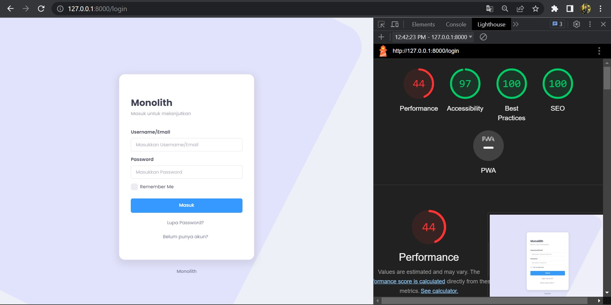
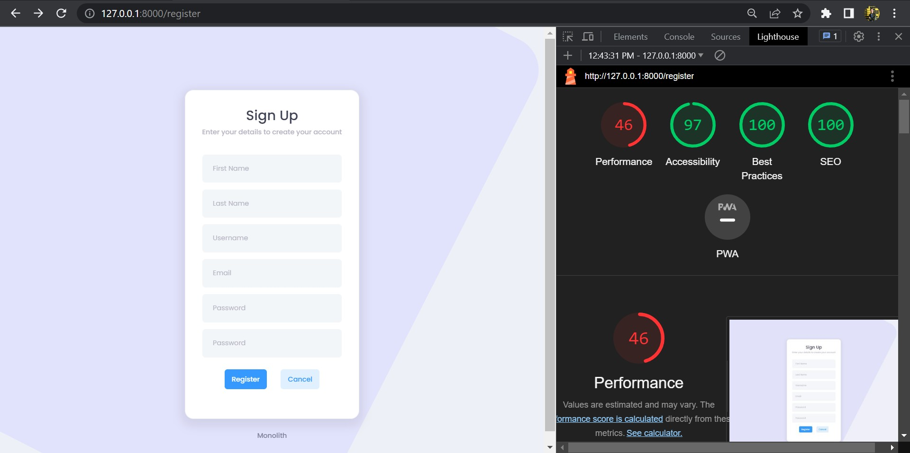
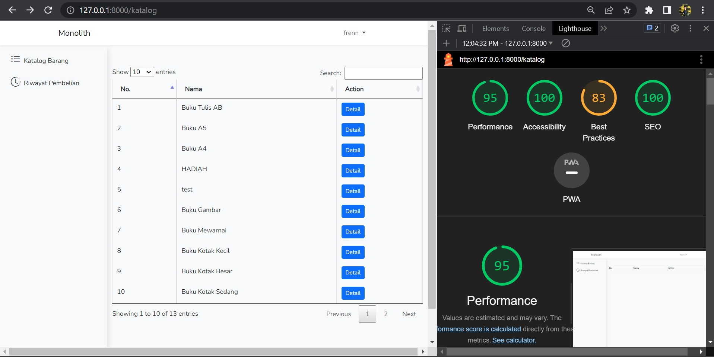
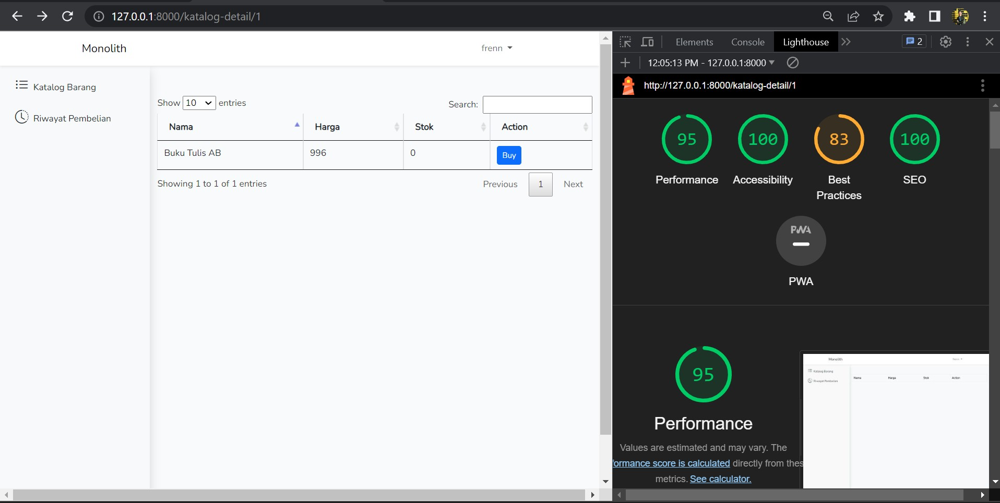
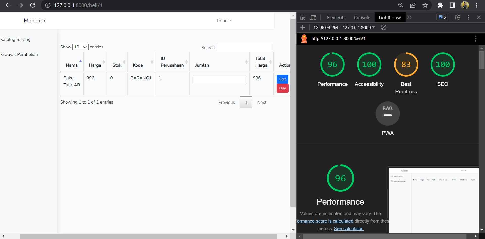
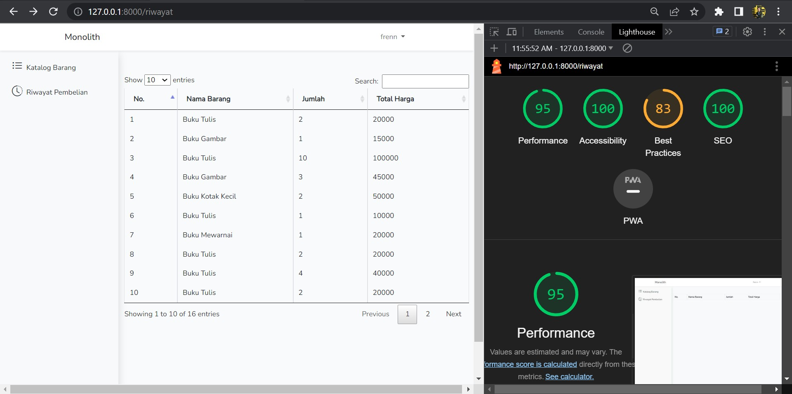

# Monolith


## Description
Monolith merupakan sebuah aplikasi yang digunakan untuk transaksi jual beli. Singkatnya, Monolith adalah aplikasi e-commerce. Data-data produk diambil melalui [Single Service](https://github.com/frendysanusi05/SingleService-Backend)

<br>

## List of Contents
1. [Description](#description)
2. [Tech Stack](#tech-stack)
3. [Design Patterns](#design-patterns)
4. [How to Run](#how-to-run)
5. [API Endpoints](#api-endpoints)
6. [Bonuses](#bonuses)
7. [Made with Love by](#made-with-love-by)

<br>

## Tech Stack
### Tech
* PHP v8.2.4
* Laravel v10.15.0          => framework PHP
* Docker-compose v2.19.1    => container

### Database
* MySQL v8.0.34
* DBeaver        => DBMS Tools

<br>

## Design Patterns
1. Chain of Responsibility

Digunakan untuk menghubungkan berbagai objek dalam sebuah rantai sehingga dapat dilakukan penanganan request secara terurut. Alur perjalanan request adalah Middleware -> Routes -> Controllers -> Models -> Views -> Databases

2. MVC (Model-View-Controller)

Diimplementasikan oleh struktur MVC (Model-View-Controller) sehingga setiap directory memiliki fungsinya masing-masing dan mudah dilakukan maintenance

3. Decorator

Diimplementasikan oleh directory middleware untuk menghindari penulisan kode berulang saat mengecek autentikasi, melakukan enkripsi cookie, maupun mengeset header di setiap page

4. Facades

Digunakan pada setiap file yang memerlukan akses ke directory lain sehingga memudahkan penghafalan sintaks tanpa harus mengingat sintaks aslinya

<br>

## How to Run
1. Clone repository ini

2. Masuk ke directory
``` 
cd /Monolith-Fullstack 
```

3. Buat file .env dengan command berikut
* Windows
``` 
copy .env.example .env
```
* Linux
```
cp .env.example .env
```

4. Jika menggunakan Docker Desktop, jalankan aplikasi tersebut terlebih dahulu

5. Pada terminal/cmd, jalankan command makefile berikut.
```
make setup 
```

<br>

## API Endpoints
### User Endpoints
| No | HTTP Method  | Endpoints                  | Access    |
| -- | ------------ | -------------------------- | --------- |
| 1  | POST         | /login                     | All       |
| 2  | POST         | /register                  | All       |

### Katalog Barang Endpoints
| No | HTTP Method  | Endpoints                  | Access    |
| -- | ------------ | -------------------------- | --------- |
| 1  | GET          | /katalog                   | User      |
| 2  | GET          | /katalog-detail/:id        | User      |
| 3  | GET          | /get-barang                | User      |
| 4  | GET          | /get-detail-barang/:id     | User      |

### Beli Barang Endpoints
| No | HTTP Method  | Endpoints                  | Access    |
| -- | ------------ | -------------------------- | --------- |
| 1  | GET          | /beli/:id                  | User      |
| 2  | GET          | /get-identitas-barang/:id  | User      |
| 3  | GET          | /transaksi/:id/"jumlah     | User      |

### Riwayat Transaksi Endpoints
| No | HTTP Method  | Endpoints                  | Access    |
| -- | ------------ | -------------------------- | --------- |
| 1  | GET          | /riwayat                   | User      |
| 2  | GET          | /get-riwayat/:id           | User      |

<br>

## Bonuses
### B05 - Lighthouse
1. Page Login



Terlihat bahwa indikator performance sangat buruk. Hal ini karena website menggunakan [template bundle css](public/assets/css). Solusi yang dapat diberikan adalah menghapus beberapa kode yang tidak digunakan dari bundle tersebut, namun perlakuan tersebut membutuhkan waktu yang cukup lama (author tidak memiliki cukup waktu)

2. Page Register



Terlihat bahwa indikator performance sangat buruk. Hal ini karena website menggunakan [template bundle css](public/assets/css). Solusi yang dapat diberikan adalah menghapus beberapa kode yang tidak digunakan dari bundle tersebut, namun perlakuan tersebut membutuhkan waktu yang cukup lama (author tidak memiliki cukup waktu)

3. Page Katalog Barang



Memiliki skor rata-rata sebesar 94.5 (dibulatkan menjadi 95)

4. Page Detail Barang



Memiliki skor rata-rata sebesar 94.5 (dibulatkan menjadi 95)

5. Page Beli Barang



Memiliki skor rata-rata sebesar 94.5 (dibulatkan menjadi 95)

6. Page Riwayat Pembelian



Memiliki skor rata-rata sebesar 94.5 (dibulatkan menjadi 95)

<br>

### B06 - Responsive Layout
Luckily, tampilan website ini menggunakan Bootstrap langsung dari Laravel sehingga layout otomatis responsif. Hal ini dapat dilakukan dengan menggunakan command 
```
php artisan ui:bootstrap
```

<br>

### B11 - Fitur Tambahan
1. Search Functionality

Mengimplementasikan fitur search pada page katalog barang dan riwayat barang

<br>

## Made with Love by
Frendy Sanusi - 18221041

Sistem dan Teknologi Informasi

Institut Teknologi Bandung
