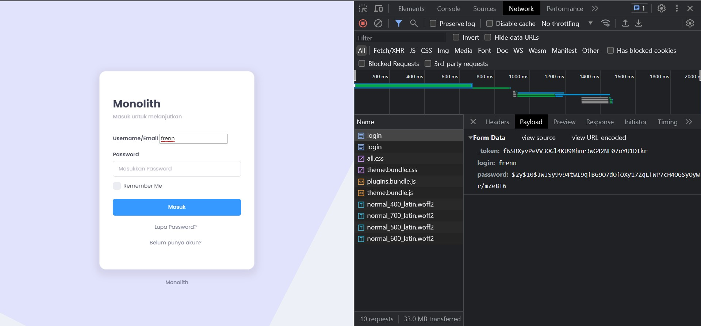
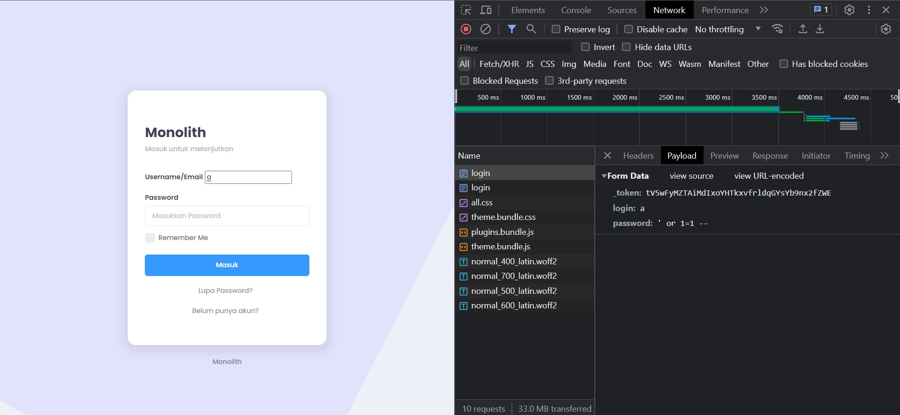
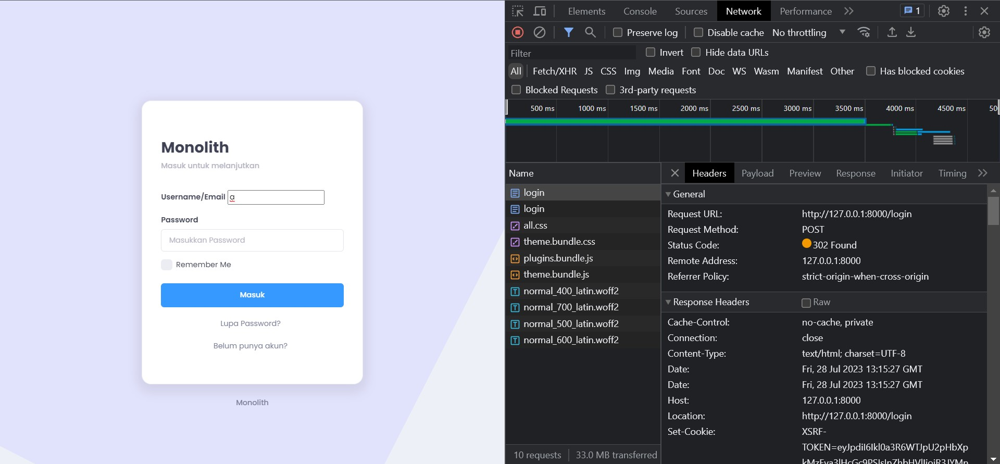
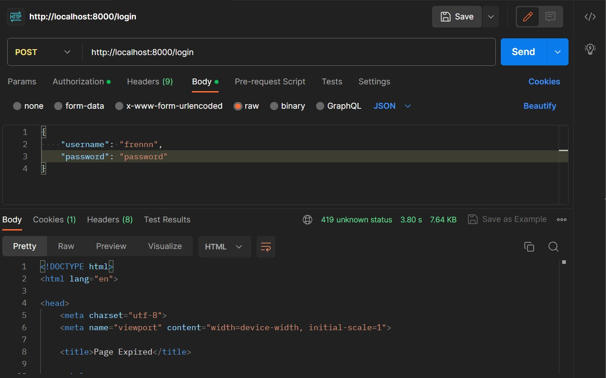

# Monolith


## Description
Monolith merupakan sebuah aplikasi yang digunakan untuk transaksi jual beli. Singkatnya, Monolith adalah aplikasi e-commerce. Data-data produk diambil melalui [Single Service](https://github.com/frendysanusi05/SingleService-Backend)

<br>

## List of Contents
1. [Description](#description)
2. [Tech Stack](#tech-stack)
3. [Design Patterns](#design-patterns)
4. [How to Run](#how-to-run)
5. [API Endpoints](#api-endpoints)
6. [Bonuses](#bonuses)
7. [Made with Love by](#made-with-love-by)

<br>

## Tech Stack
### Tech
* PHP v8.2.4
* Laravel v10.15.0          => framework PHP
* Docker-compose v2.19.1    => container

### Database
* MySQL v8.0.34
* DBeaver        => DBMS Tools

<br>

## Design Patterns
1. Chain of Responsibility

Digunakan untuk menghubungkan berbagai objek dalam sebuah rantai sehingga dapat dilakukan penanganan request secara terurut. Alur perjalanan request adalah Middleware -> Routes -> Controllers -> Models -> Views -> Databases

2. MVC (Model-View-Controller)

Diimplementasikan oleh struktur MVC (Model-View-Controller) sehingga setiap directory memiliki fungsinya masing-masing dan mudah dilakukan maintenance

3. Decorator

Diimplementasikan oleh directory middleware untuk menghindari penulisan kode berulang saat mengecek autentikasi, melakukan enkripsi cookie, maupun mengeset header di setiap page

4. Facades

Digunakan pada setiap file yang memerlukan akses ke directory lain sehingga memudahkan penghafalan sintaks tanpa harus mengingat sintaks aslinya

<br>

## How to Run
1. Clone repository ini

2. Masuk ke directory
``` 
cd /Monolith-Fullstack 
```

3. Buat file .env dengan command berikut
* Windows
``` 
copy .env.example .env
```
* Linux
```
cp .env.example .env
```

4. Jika menggunakan Docker Desktop, jalankan aplikasi tersebut terlebih dahulu

5. Pada terminal/cmd, jalankan command makefile berikut.
```
make setup 
```

<br>

## Bonuses
### B01 - OWASP
* Cryptographic Failure

Serangan ini dilakukan apabila penyusup mampu memperoleh data sensitif dari hasil MITM (Man-In-The-Middle Attack). Misalkan penyusup memperoleh data user dan password, namun password masih dalam bentuk enkripsi.



Terlihat bahwa penyusup tidak berhasil melakukan login. Hal ini karena Laravel melakukan enkripsi password menggunakan bcrypt yang belum ditemukan metode dekripsinya.


* Injection

Metode injection yang digunakan adalah SQL injection, salah satu metode yang paling umum digunakan. Thanks to Laravel, Laravel menggunakan Eloquent ORM sehingga website tidak dapat diinjeksi.





* Server-Side Request Forgery

Thanks to Laravel, serangan ini telah di-handle oleh CSRF. Ketika melakukan login, server akan meminta token yang hanya dimiliki oleh user tertentu dan tidak di-send melalui jaringan (hanya ada di lokal) sehingga hampir tidak mungkin untuk melakukan serangan ini (token tidak dapat di-bruteforce)




### B05 - Lighthouse
1. Page Login


Terlihat bahwa indikator performance sangat buruk. Hal ini karena website menggunakan [template bundle css](public/assets/css). Solusi yang dapat diberikan adalah menghapus beberapa kode yang tidak digunakan dari bundle tersebut, namun perlakuan tersebut membutuhkan waktu yang cukup lama (author tidak memiliki cukup waktu)

2. Page Register


Terlihat bahwa indikator performance sangat buruk. Hal ini karena website menggunakan [template bundle css](public/assets/css). Solusi yang dapat diberikan adalah menghapus beberapa kode yang tidak digunakan dari bundle tersebut, namun perlakuan tersebut membutuhkan waktu yang cukup lama (author tidak memiliki cukup waktu)

3. Page Katalog Barang


Memiliki skor rata-rata sebesar 94.5 (dibulatkan menjadi 95)

4. Page Detail Barang


Memiliki skor rata-rata sebesar 94.5 (dibulatkan menjadi 95)

5. Page Beli Barang


Memiliki skor rata-rata sebesar 94.5 (dibulatkan menjadi 95)

6. Page Riwayat Pembelian


Memiliki skor rata-rata sebesar 94.5 (dibulatkan menjadi 95)

<br>

### B06 - Responsive Layout
Luckily, tampilan website ini menggunakan Bootstrap langsung dari Laravel sehingga layout otomatis responsif. Hal ini dapat dilakukan dengan menggunakan command 
```
php artisan ui:bootstrap
```

<br>

### B11 - Fitur Tambahan
1. Search Functionality

Mengimplementasikan fitur search pada page katalog barang dan riwayat barang

<br>

## Made with Love by
Frendy Sanusi - 18221041

Sistem dan Teknologi Informasi

Institut Teknologi Bandung
